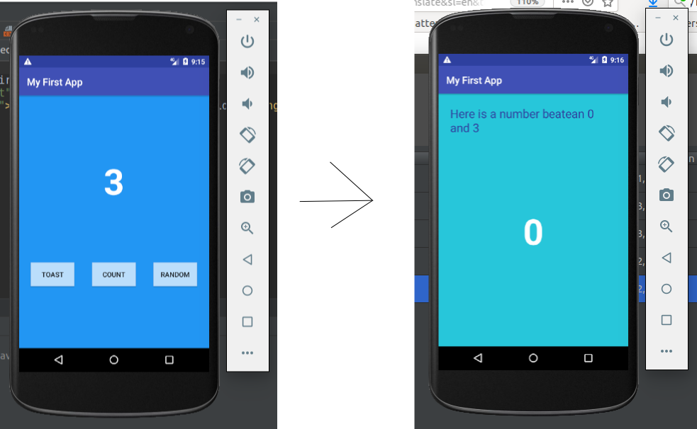

```txt

Google codeLab - https://codelabs.developers.google.com/codelabs/build-your-first-android-app-kotlin/index.html#0

First Android App (Kotlin version)

minSdkVersion=16
compileSdkVersion=27

What I am learn:
    - Kotlin syntax vs [Java](https://github.com/alexaleluia12/gcl-first-android-app)
```
